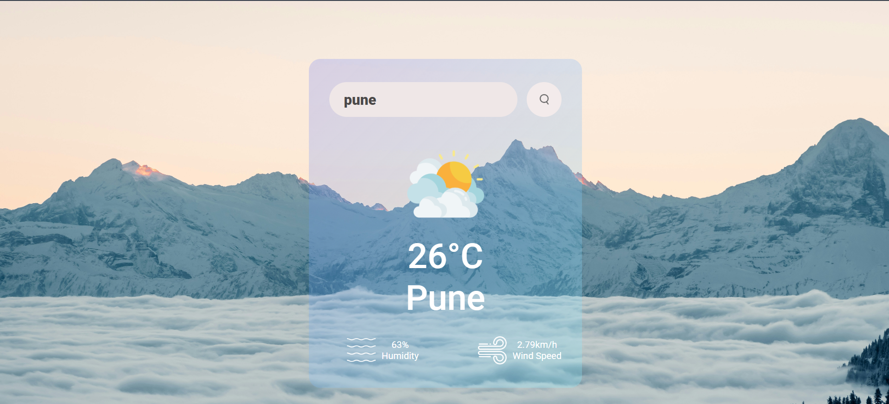

# Weather‑app

A simple weather application built with HTML, CSS and JavaScript that allows users to check the current weather conditions of a city by name.  
Live demo: [https://weather-app-cyan-psi.vercel.app](https://weather-app-web-ten.vercel.app/)




---

## 🛠️ Features

- Search for a city and view its current weather.  
- Displays important weather details such as temperature, humidity, wind speed, weather description etc.  
- A clean, responsive design built with CSS.  
- Plain JavaScript (no frameworks) for simplicity.

---

## 📁 Project Structure

```
/
├─ images/             ← folder containing any image assets
├─ index.html          ← main HTML page
├─ style.css           ← styling for the app
├─ script.js           ← JavaScript logic for fetching and displaying weather
```

---

## ✅ How to Use / Run Locally

1. Clone the repo  
   ```bash
   git clone https://github.com/yogesh032003/Weather-app.git
   ```
2. Navigate into the project directory  
   ```bash
   cd Weather-app
   ```
3. Open `index.html` in your web browser or serve via a local web server.  
4. In the app, type in a city name and press Enter / click Search to fetch and display weather information.

> Note: You will likely need to supply your own API key (for example from OpenWeather) in `script.js` if not already configured.

---

## ⚙️ Configuration & API Key

- In `script.js`, locate the line where the API endpoint is defined.  
- Replace `YOUR_API_KEY_HERE` (or similar placeholder) with your valid weather API key.  
- Ensure that the key has permission for current weather data for free-tier or paid-tier as required.

---


## 👤 Author

**Yogesh**  
– GitHub: [@yogesh032003](https://github.com/yogesh032003)   

---

Thank you for checking out this project — happy coding!
